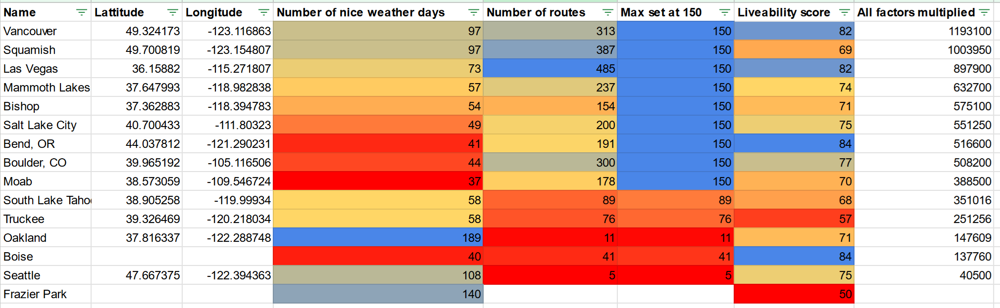

# Rock Climbing City Analysis

## Premise
My experience living in San Carlos de Bariloche for two months has made me appreciate locations where climbing day trips are possible. As part of my own exploration of where I would like to live, I was curious to find a way to determine how many good quality climbs are within day-trip distance to each city.

For this project, I defined good quality climbs as:
1. Routes rated between 5.9 and 5.11a (I limited this to a small range that I'm most interested in climbing).
2. Routes with 3 or more stars on Mountain Project, sorted by most popular first (to weed out single review routes where possible).

Bariloche has 116 good quality routes nearby, so I'm looking for cities that at least match that. The furthest I traveled for a day climbing trip from Bariloche was Valle Encantado, which was 30 miles as the bird flies, so I set that as the distance that qualifies as day-trippable.

## Data

Source of data: Mountain Project

As Mountain Project only allows 1000 results per search to be downloaded, I appended the top most popular 1000 climbs for each state to the .csv data file. I'm hoping that by doing this, it will filter out the routes that only have one review. However, this doesn't work well for Washington, as I noticed a few odd routes added by individuals who climbed buildings and the only review is by themselves.

I created a Google MyMaps to interact with the data. This already seems fairly useful in comparison to using the Mountain Project map tool.

[Interactive Google MyMaps link with downloaded data](https://www.google.com/maps/d/u/0/edit?mid=1NHlL4-prrwB-lj2idpbetLZ-B0ljI2s&usp=sharing)

## Results

I decided to add factors for how many nice weather days each location has. What is the point of living somewhere with all the climbs in the world if the weather is never good enough to enjoy them? [Zillow pleasant days article](https://www.zillow.com/research/pleasant-days-methodology-8513/)

Zillow defines a pleasant day here as:
- The mean temperature is between 55 and 75°F.
- The minimum temperature is above 45°F and the maximum temperature is below 85°F.
- There's no significant precipitation or snow depth.

These seem like fairly ideal climbing conditions.

I also added a livability score for each city, which is a combination of nearby amenities, commute, cost of living, crime rates, employment, health & safety, schools, housing, and user ratings. All of these factors are important to consider when choosing a place to live. [Area vibes website link](https://www.areavibes.com/)

I set a cap of 150 for the maximum number of routes nearby an area, as the high count that Las Vegas and a few other cities had in comparison to the rest was skewing the data. I decided that if I lived somewhere with around 150 excellent routes, there would be plenty for me to climb before getting bored.

Finally, I multiplied all the factors together to see which areas came out on top.

## Conclusion

### Las Vegas
My first takeaway was how many good quality climbs there were nearby Las Vegas. I already knew that the number would be large, but I didn't expect the difference between it and the 2nd place city in the US to be so significant! (485 vs. 300 for Boulder) Red Rocks is truly a special place, and it is clear why so many rock climbers choose to buy houses there. It also appears very high on the list due to the relatively high number of nice days with 73. To be perfectly honest, I don't want to live in Las Vegas, and I found it deeply disturbing to see it remain at the #1 spot for quite some time. I may have set the max route limit specifically as a way to plead with the data not to tell me to live there. I'm less into cities with apocalyptic heat waves that are reliant on the Colorado River for all their water and more into pristine alpine environments.

### Boulder, Colorado
I think Boulder really got shafted unfairly here with the low count of nice weather days at 44. Reading online, it sounds like the locals find days to climb all year round, even when it is cold. From my time spent in Boulder, I think the low count here is due to consistent daily thunderstorms during the warm months. On these days, climbing trips are possible when leaving early and exiting before the storms roll in around 2 pm. With the very high count of climbs available in the area and a decent livability score, it's clear to me that Boulder is a top contender for sure.

### Salt Lake City
When I started this project, I expected Salt Lake City to rank very highly since I knew there were many good quality climbs close to the city. I didn't expect it to rank lower than Mammoth Lakes and Bishop, though. It also does fairly poorly on the number of nice days stat. I wonder what is going on with that?

### Truckee and South Lake Tahoe
For the past few years, I've fantasized about living in Truckee as someone who lives in the Bay Area and passes through every once in a while on outdoor adventures. I have always loved the Sierras, and Truckee is a beautiful town with cabins that are more affordable than houses in the Bay Area, with Reno and Sacramento nearby. I really thought this would score higher in comparison for the number of routes nearby, and I was surprised to find that South Lake Tahoe scores higher in every way. I hadn't even thought to consider South Lake Tahoe until I noticed that there is a decent rock climbing gym in town. RIP living in Truckee dreams. South Lake Tahoe is nearby and better in every way. Both score at the bottom of the list compared to other cities, though. I do think that since California has so many climbs in the state and I only downloaded the top 1000 popular ones, California locations might score lower here.

### Mammoth Lakes and Bishop
I added these not as real contenders since they are both a 3-hour drive from the nearest city, and housing options there are limited. I really do like both of these places but have given up the idea of living there long ago because of this. I met someone in Bariloche who lived in Mammoth Lakes and owned a hostel for people who hike the PCT. Their take on Mammoth Lakes was that it was an excellent place to live and climb, but the area gets very busy during the winter. I was surprised to see that both of these towns beat out Salt Lake City and Boulder based on the factors of nice weather days and livability. The main reason for this is the lower nice days score. I'm really curious about what is going on with that.

### Frazier Park, California
My hometown! I added this one just so I could see how the environment I grew up in compares to the rest. I remember many good weather days, but 140 really seems like a lot in comparison to the rest of these here, neat. That 50 livability score, though, yeeesh. I suppose you can't expect many amenities from a small desert mountain town. Maybe this is a lesson for me that life can still be good in areas with low livability scores, and maybe this factor doesn't matter as much.

### Bay Area and Seattle
It is hard to believe how few routes there are within a day trip distance to the Bay Area and Seattle. After living in the Bay Area for over 5 years, I've known that day climbing trips are hard to do, and the rock quality is fairly poor (areas like Mt. Diablo, Castle Rock). It really is crazy to see how many nice days there are in the Bay Area in comparison to the rest of the country. All of the California coast cities have a ridiculously high number of nice days, with San Diego in first place with 261. How does Seattle only have 5 climbs within 30 miles of downtown? I really would have expected Seattle to have more climbing day trip possibilities. The depressingly low number of climbs around both these areas is what causes them to have such poor scores and be at the bottom of the list.

### Vancouver
Is this it? Is this my new home? The Pacific Ocean creates a mild climate near Vancouver, causing there to be 97 nice weather days, similar to the effect on the California coast. It's interesting; I didn't even think to add Vancouver until the very end and was completely surprised by how uncontested it is for the highest spot. Something unusual happens when I compare the climate in Bariloche to Vancouver, [they're nearly identical](https://weatherspark.com/compare/y/25786~471/Comparison-of-the-Average-Weather-in-San-Carlos-de-Bariloche-and-North-Vancouver). Wouldn't it be lovely to design a life around moving between Vancouver and Bariloche and climbing when the weather is nice?
