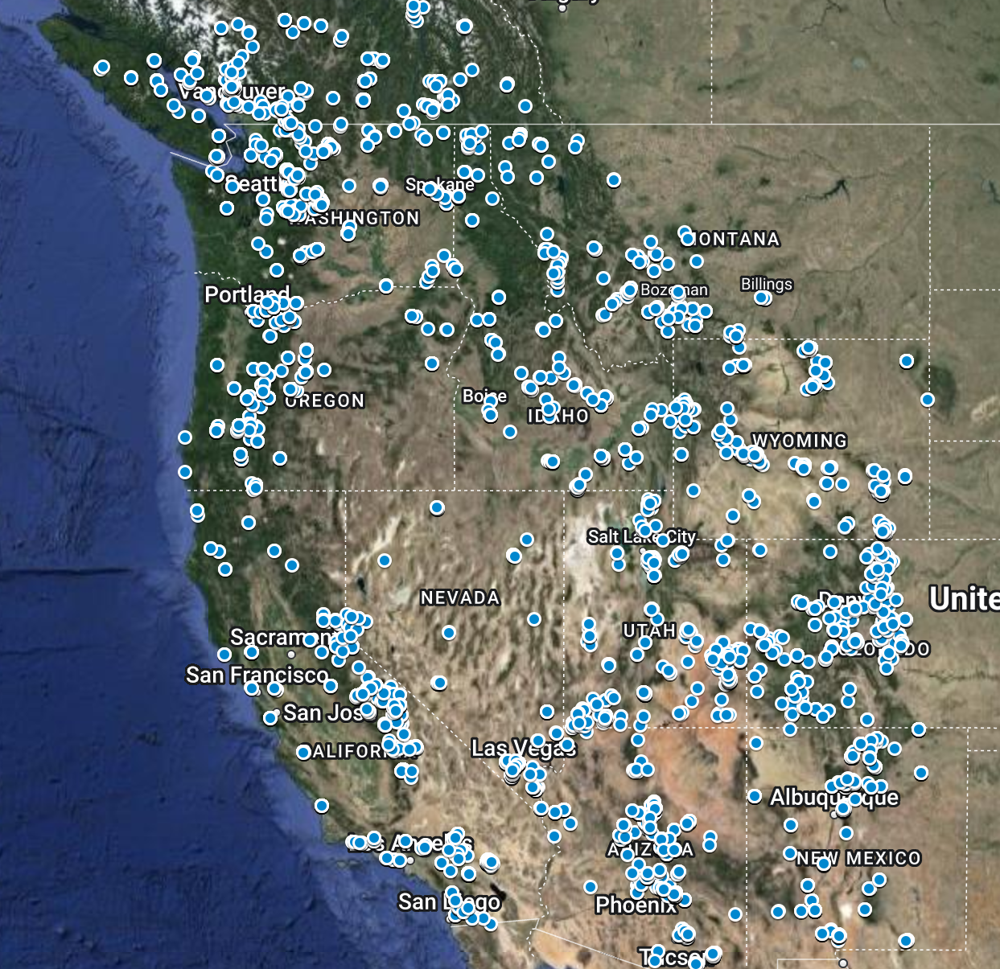

# Rock Climbing City Analysis

## Premise
My experience living in San Carlos de Bariloche for two months has made me appreciate locations where climbing day trips are possible. As part of my own exploration of where I would like to live, I was curious to find a way to determine how many good quality climbs are within day-trip distance to each city.

For this project, I defined good quality climbs as:
1. Routes rated between 5.8 and 5.11c
2. Routes with 3 or more stars on Mountain Project

Bariloche has 223 good quality routes nearby, so I'm looking for cities that at least match that. The furthest I traveled for a day climbing trip from Bariloche was Valle Encantado, which was 30 miles as the bird flies, so I set that as the distance that qualifies as day-trippable.

## Data

### Route data:

Source of data: Mountain Project

For each rock climbing region I downloaded all routes between 5.7 and 5.11c that are rated 3 stars and above. Mountain Project only allows you to download up to 1000 routes so any area that had more results than that I broke up into multiple downloads to ensure I got every route nearby cities I was interested in analysing as part of this.

Here is a sample of the data mapped. This is not a complete set since Google MyMaps can only store up to 10,000 points of interest and there are more routes in this dataset than that.

[](https://www.google.com/maps/d/u/0/edit?mid=1NHlL4-prrwB-lj2idpbetLZ-B0ljI2s&usp=sharing)

The image is a hotlink, feel free to browse the map data as you like.

### Prime climbing conditions data

I also wanted to find data I could use to determine how much of the year you can expect to be able to climb. What is the point of living next door to hundreds of glorious climbs if the weather is never good for climbing?

I found buried in the javascript for each climbing area what I think is the number of total ticks people have submitted per month for that area.

Example:

```
var dataClimbSeason = [["January",403],["February",460],["March",993],["April",1074],["May",1228],["June",1113],["July",1031],["August",1152],["September",1294],["October",887],["November",627],["December",283]];
```

I wanted to turn this data into a score 0-12 for how many total months in the year you can expect to find climbing weather. One problem I had is some places like Squamish have a large spike during July and August which would make dwarf all other months. Reading online you can expect to find climbing weather between April and September so I needed to find a process which would match somewhat with climber observations. After trying a variety of methods what I think works best is taking the average of the minimum and the maximum value in the set. Then resetting any month with a higher count than the average to that average value. Afterwards when all of the tourist spikes have been leveled out, sum all the data then devide that sum by the average to get the final score.

I found and considered using [Zillow pleasant days article](https://www.zillow.com/research/pleasant-days-methodology-8513/) data. At first it seemed like a reasonable way to determine how much of the year you could climb, but then I saw that Boulder Colorado only had 44 good weather days in the year while the prime climbing season data from mountain project showed there was consistent climbing all year round. Since these disagreed too much I decided not to use this data.

## Results

### Cities ranked by number of climbs 5.7 to 5.11c within 30 miles

| Rank | City                        | Count |
|------|-----------------------------|-------|
| 1    | Mammoth Lakes CA            | 723   |
| 2    | Las Vegas                   | 720   |
| 3    | Bishop                      | 581   |
| 4    | Squamish                    | 541   |
| 5    | Boulder, Colorado           | 518   |
| 6    | Lafayette Colorado          | 518   |
| 7    | Vancouver                   | 517   |
| 8    | Moab                        | 468   |
| 9    | Salt Lake City              | 435   |
| 10   | South Lake Tahoe            | 343   |
| 11   | Bend                        | 317   |
| 12   | Truckee                     | 279   |
| 13   | Tucson                      | 278   |
| 14   | Leavenworth WA              | 260   |
| 15   | San Diego                   | 257   |
| 16   | Wentachee WA                | 248   |
| 17   | Flagstaff                   | 248   |
| 18   | Phoenix                     | 137   |
| 19   | Boise                       | 64    |
| 20   | San Francisco Mission Cliffs| 53    |
| 21   | Pacific Pipe Oakland        | 53    |
| 22   | Seattle                     | 28    |
| 23   | Frazier Park                | 27    |
| 24   | Sacramento                  | 24    |

### Prime climbing months

| Rank | City              | Number of climbing months |
|------|-------------------|--------------------------|
| 1    | East Bay Area     | 11.2                     |
| 2    | San Diego         | 10.6                     |
| 3    | Eldorado          | 10.5                     |
| 4    | Tucson            | 10.4                     |
| 5    | Flagstaff         | 9.9                      |
| 6    | Sierra Eastside   | 9.4                      |
| 7    | Smith Rock        | 9.2                      |
| 8    | Wasatch Range     | 8.7                      |
| 9    | Owen's River Gorge| 8.6                      |
| 10   | Lake Tahoe        | 8.4                      |
| 11   | Phoenix           | 8.2                      |
| 12   | Las Vegas         | 7.9                      |
| 13   | Leavenworth       | 7.9                      |
| 14   | Squamish          | 5.5                      |
| 15   | Indian Creek      | 5.5                      |
| 16   | Bariloche         | 4.1                      |

### Which city is the best to live in and climb? (according to what I find most important)

I wanted to combine these two factors along with a couple of my own subjective ratings for each of these cities:
1. The quality of the rock climbing gyms in the city as I find that an important factor for climber happiness during bad weather days
1. The epicness of the nearby nature and my own desire to explore the trails of the area

I set a cap of 500 for the maximum number of routes because past that number I don't think it mattered for the score. As a climbing partner I had in El Dorado 'Patrick' who has been climbing around Boulder for 20 years told me "There is 7 lives worth of climbing to be done around here". Since Boulder scored 518 routes nearby, I figured 500 was more than enough to keep me busy for life.

With these factors combined and weighted according to how important I feel each factor is I have the final results!

#### 1: Boulder Colorado

| Prime climbing months | Number of Routes | Rock climbing gym score | Nearby Nature | Overall weighted score |
|----------------------|-----------------|------------------------|---------------|-----------------------|
| 10.5                 | 518             | 5/5                    | 4/5           | 93/100                |

[](https://www.google.com/maps/d/u/0/edit?mid=1-ueyKpZ82WNmPRCWwB2APAD29sOxdXU&usp=sharing)


## Conclusion

### Las Vegas
My first takeaway was how many good quality climbs there were nearby Las Vegas. I already knew that the number would be large, but I didn't expect the difference between it and the 2nd place city in the US to be so significant! (485 vs. 300 for Boulder) Red Rocks is truly a special place, and it is clear why so many rock climbers choose to buy houses there. It also appears very high on the list due to the relatively high number of nice days with 73. To be perfectly honest, I don't want to live in Las Vegas, and I found it deeply disturbing to see it remain at the #1 spot for quite some time. I may have set the max route limit specifically as a way to plead with the data not to tell me to live there. I'm less into cities with apocalyptic heat waves that are reliant on the Colorado River for all their water and more into pristine alpine environments.

### Boulder, Colorado
I think Boulder really got shafted unfairly here with the low count of nice weather days at 44. Reading online, it sounds like the locals find days to climb all year round, even when it is cold. From my time spent in Boulder, I think the low count here is due to consistent daily thunderstorms during the warm months. On these days, climbing trips are possible when leaving early and exiting before the storms roll in around 2 pm. With the very high count of climbs available in the area and a decent livability score, it's clear to me that Boulder is a top contender for sure.

### Salt Lake City
When I started this project, I expected Salt Lake City to rank very highly since I knew there were many good quality climbs close to the city. I didn't expect it to rank lower than Mammoth Lakes and Bishop, though. It also does fairly poorly on the number of nice days stat. I wonder what is going on with that?

### Truckee and South Lake Tahoe
For the past few years, I've fantasized about living in Truckee as someone who lives in the Bay Area and passes through every once in a while on outdoor adventures. I have always loved the Sierras, and Truckee is a beautiful town with cabins that are more affordable than houses in the Bay Area, with Reno and Sacramento nearby. I really thought this would score higher in comparison for the number of routes nearby, and I was surprised to find that South Lake Tahoe scores higher in every way. I hadn't even thought to consider South Lake Tahoe until I noticed that there is a decent rock climbing gym in town. RIP living in Truckee dreams. South Lake Tahoe is nearby and better in every way. Both score at the bottom of the list compared to other cities, though. I do think that since California has so many climbs in the state and I only downloaded the top 1000 popular ones, California locations might score lower here.

### Mammoth Lakes and Bishop
I added these not as real contenders since they are both a 3-hour drive from the nearest city, and housing options there are limited. I really do like both of these places but have given up the idea of living there long ago because of this. I met someone in Bariloche who lived in Mammoth Lakes and owned a hostel for people who hike the PCT. Their take on Mammoth Lakes was that it was an excellent place to live and climb, but the area gets very busy during the winter. I was surprised to see that both of these towns beat out Salt Lake City and Boulder based on the factors of nice weather days and livability. The main reason for this is the lower nice days score. I'm really curious about what is going on with that.

### Frazier Park, California
My hometown! I added this one just so I could see how the environment I grew up in compares to the rest. I remember many good weather days, but 140 really seems like a lot in comparison to the rest of these here, neat. That 50 livability score, though, yeeesh. I suppose you can't expect many amenities from a small desert mountain town. Maybe this is a lesson for me that life can still be good in areas with low livability scores, and maybe this factor doesn't matter as much.

### Bay Area and Seattle
It is hard to believe how few routes there are within a day trip distance to the Bay Area and Seattle. After living in the Bay Area for over 5 years, I've known that day climbing trips are hard to do, and the rock quality is fairly poor (areas like Mt. Diablo, Castle Rock). It really is crazy to see how many nice days there are in the Bay Area in comparison to the rest of the country. All of the California coast cities have a ridiculously high number of nice days, with San Diego in first place with 261. How does Seattle only have 5 climbs within 30 miles of downtown? I really would have expected Seattle to have more climbing day trip possibilities. The depressingly low number of climbs around both these areas is what causes them to have such poor scores and be at the bottom of the list.

### Vancouver
Is this it? Is this my new home? The Pacific Ocean creates a mild climate near Vancouver, causing there to be 97 nice weather days, similar to the effect on the California coast. It's interesting; I didn't even think to add Vancouver until the very end and was completely surprised by how uncontested it is for the highest spot. Something unusual happens when I compare the climate in Bariloche to Vancouver, [they're nearly identical](https://weatherspark.com/compare/y/25786~471/Comparison-of-the-Average-Weather-in-San-Carlos-de-Bariloche-and-North-Vancouver). Wouldn't it be lovely to design a life around moving between Vancouver and Bariloche and climbing when the weather is nice?
