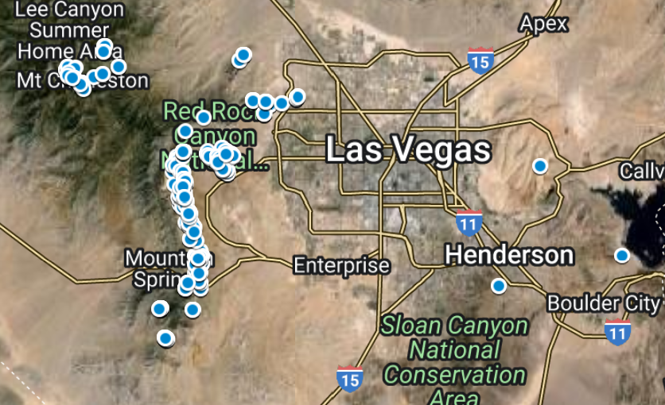

# Rock Climbing City Analysis

## Premise
My experience living in San Carlos de Bariloche for two months has made me appreciate locations where climbing day trips are possible. As part of my own exploration of where is best for a climber to live, I was curious to find a way to determine how many good quality climbs are within day-trip distance to each city.

For this project, I defined good quality climbs as:
1. Routes rated between 5.7 and 5.11c
2. Routes with 3 or more stars out of 4 on [Mountain Project](https://www.mountainproject.com/)

[Bariloche](https://www.google.com/maps/d/u/0/edit?mid=17kZugf5Q51gzK-ESIg7yvpMG5pr8CPU&usp=sharing) has 223 good quality routes nearby, so I'm looking for cities that at least match that. The furthest I traveled for a day climbing trip from Bariloche was Valle Encantado, which was 30 miles as the bird flies, so I set that as the distance that qualifies as day-trippable.

I then downloaded tick rate per month data from mountain project and used it to estimate how much of the year one can expect to climb at that location. After combining these two factors with the quality of the rock climbing gyms and my own perception of how epic the nearby nature I end up with a ranked list of what I believe are the best cities for a nature loving rock climber like myself to live in.

## Data

### Route data:

Source of data: Mountain Project

For each rock climbing region I downloaded all routes between 5.7 and 5.11c that are rated 3 stars and above. Mountain Project only allows you to download up to 1000 routes so any area that had more results than that I broke up into multiple downloads to ensure I got every route nearby cities I was interested in analysing as part of this.

Here is a sample of the data mapped. This is not a complete set since Google MyMaps can only store up to 10,000 points of interest and there are more routes in this dataset than that.

[](https://www.google.com/maps/d/u/0/edit?mid=1NHlL4-prrwB-lj2idpbetLZ-B0ljI2s&usp=sharing)

The image is a hotlink, feel free to browse the map data as you like.

### Prime climbing conditions data

I also wanted to find data I could use to determine how much of the year you can expect to be able to climb. What is the point of living next door to hundreds of glorious climbs if the weather is never good for climbing?

I found buried in the javascript for each climbing area what I think is the number of total ticks people have submitted per month for that area.

Example:

```
var dataClimbSeason = [["January",403],["February",460],["March",993],["April",1074],["May",1228],["June",1113],["July",1031],["August",1152],["September",1294],["October",887],["November",627],["December",283]];
```

I wanted to turn this data into a score 0-12 for how many total months in the year you can expect to find climbing weather. One problem I had is some places like Squamish have a large spike during July and August which would dwarf all other months and result with a score of 2 or 3 out of 12. Reading online you can expect to find climbing weather between April and September so I needed to find a process which would match somewhat with climber observations. After trying a variety of methods, what I think works best is to take the average of the minimum and the maximum value in the set. Then resetting any month with a higher count than the average to that average value. Afterwards when all of the tourist spikes have been leveled out, sum all the data then devide that sum by the average to get the final score.

I found and also considered using [Zillow pleasant days article](https://www.zillow.com/research/pleasant-days-methodology-8513/) data. At first it seemed like a reasonable way to determine how much of the year you could climb, but then I saw that it claimed Boulder Colorado only had 44 good weather days in the year while the prime climbing season data from mountain project showed there was consistent climbing all year round. Since these disagreed too much I decided not to use this data.

## Results

### Cities ranked by number of climbs 5.7 to 5.11c within 30 miles

| Rank | City                        | Count |
|------|-----------------------------|-------|
| 1    | Mammoth Lakes CA            | 723   |
| 2    | Las Vegas                   | 720   |
| 3    | Bishop                      | 581   |
| 4    | Squamish                    | 541   |
| 5    | Boulder, Colorado           | 518   |
| 6    | Lafayette Colorado          | 518   |
| 7    | Vancouver                   | 517   |
| 8    | Moab                        | 468   |
| 9    | Salt Lake City              | 435   |
| 10   | South Lake Tahoe            | 343   |
| 11   | Bend                        | 317   |
| 12   | Truckee                     | 279   |
| 13   | Tucson                      | 278   |
| 14   | Leavenworth WA              | 260   |
| 15   | San Diego                   | 257   |
| 16   | Wentachee WA                | 248   |
| 17   | Flagstaff                   | 248   |
| 18   | Phoenix                     | 137   |
| 19   | Boise                       | 64    |
| 20   | San Francisco Mission Cliffs| 53    |
| 21   | Pacific Pipe Oakland        | 53    |
| 22   | Seattle                     | 28    |
| 23   | Frazier Park                | 27    |
| 24   | Sacramento                  | 24    |

### Prime climbing months

| Rank | City              | Number of climbing months |
|------|-------------------|--------------------------|
| 1    | East Bay Area     | 11.2                     |
| 2    | San Diego         | 10.6                     |
| 3    | Eldorado          | 10.5                     |
| 4    | Tucson            | 10.4                     |
| 5    | Flagstaff         | 9.9                      |
| 6    | Sierra Eastside   | 9.4                      |
| 7    | Smith Rock        | 9.2                      |
| 8    | Wasatch Range     | 8.7                      |
| 9    | Owen's River Gorge| 8.6                      |
| 10   | Lake Tahoe        | 8.4                      |
| 11   | Phoenix           | 8.2                      |
| 12   | Las Vegas         | 7.9                      |
| 13   | Leavenworth       | 7.9                      |
| 14   | Squamish          | 5.5                      |
| 15   | Indian Creek      | 5.5                      |
| 16   | Bariloche         | 4.1                      |

### Which city is the best to live in and climb? (according to what I find most important)

I wanted to combine these two factors along with a couple of my own subjective ratings for each of these cities:
1. The quality of the rock climbing gyms in the city. I find that an important factor for climber happiness during bad weather days
1. The epicness of the nearby nature and my own desire to explore the trails of the area

I set a cap of 500 for the maximum number of routes because past that number I don't think it mattered for the score. As a climbing partner I had in El Dorado 'Patrick' who has been climbing around Boulder for 20 years told me "There is 7 lives worth of climbing to be done around here". Since Boulder scored 518 routes nearby, I figured 500 was more than enough to keep me busy for life.

With these factors combined and weighted according to how important I feel each factor is I have the final results!  Congrats Boulder Colorado!


[](https://docs.google.com/spreadsheets/d/e/2PACX-1vQHIDwmZtQuCRsU4heNrSIP2EiA8ZHBHr17Y0_yurjtV7tqy-1gChw12tgAukRZoOFU8bPz8iRCbiJR/pubhtml)


# City day trip climbing maps
## 1: Boulder Colorado

| Prime climbing months | Number of Routes | Rock climbing gym score | Nearby Nature |
|----------------------|-----------------|------------------------|---------------|
| 10.5                 | 518             | 5/5                    | 4/5           |
Overall weighted score: 93 / 100

[](https://www.google.com/maps/d/u/0/edit?mid=1-ueyKpZ82WNmPRCWwB2APAD29sOxdXU&usp=sharing)

Looking at this map I was suprised to see so many dots within the city. After looking further I got a good laugh! Climbers in Boulder are one of a kind.

[]

## 2:  Salt Lake City Utah
| Prime climbing months | Number of Routes | Rock climbing gym score | Nearby Nature |
|----------------------|-----------------|------------------------|---------------|
|  8.7                 | 435             | 5/5                    | 4/5           |
Overall weighted score: 87 / 100

[](https://www.google.com/maps/d/u/0/edit?mid=1pAfzmOKYGYcoSPRiXKYwhgsLgzX8Yh0&usp=sharing)

[]

## 3: Vancouver, British Columbia
| Prime climbing months | Number of Routes | Rock climbing gym score | Nearby Nature |
|----------------------|-----------------|------------------------|---------------|
|  5.5                 | 517             | 4/5                    | 5/5           |
Overall weighted score: 84 / 100

[](https://www.google.com/maps/d/u/0/edit?mid=1MeQbsqzK7zQ7kM-x70ylpq_uRf2mk-4&usp=sharing)

[]

## 4: Las Vegas, Nevada
| Prime climbing months | Number of Routes | Rock climbing gym score | Nearby Nature |
|----------------------|-----------------|------------------------|---------------|
|  7.9                 | 720             | 5/5                    | 2/5           |
Overall weighted score: 78 / 100

[](https://www.google.com/maps/d/u/0/edit?mid=1Pv9w-62PklXpfx-5KcZuK-Xo4_WQfFo&usp=sharing)

[]

## 5: South Lake Tahoe, California
| Prime climbing months | Number of Routes | Rock climbing gym score | Nearby Nature |
|----------------------|-----------------|------------------------|---------------|
|  8.4                 | 343             | 4/5                    | 4/5           |
Overall weighted score: 76 / 100

[](https://www.google.com/maps/d/u/0/edit?mid=1ic1O0xherC7dsNRM5R757fkKYPPh6rM&usp=sharing)

[]